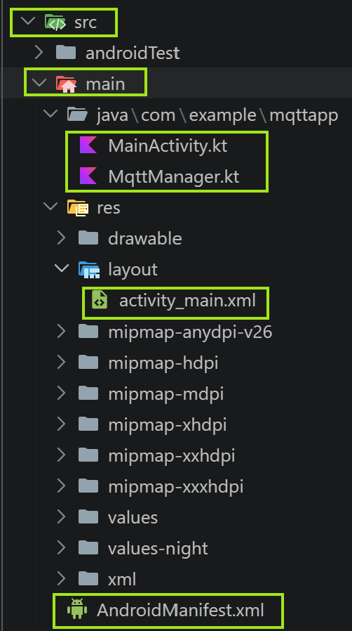

# How to Run This Project

## Clone

1. In a directory of your preference, clone this repo:

    ``` bash

    git clone git@github.com:vgmariucci/IoT_and_Embedded_Android_AOSP_Course_by_Unicamp_2026.git

    ```
    If you don't want to download all the repo folders and files, you can just create a new Android Studio project and just copy the files shown in the image below from the app directory in your project:

    
        


